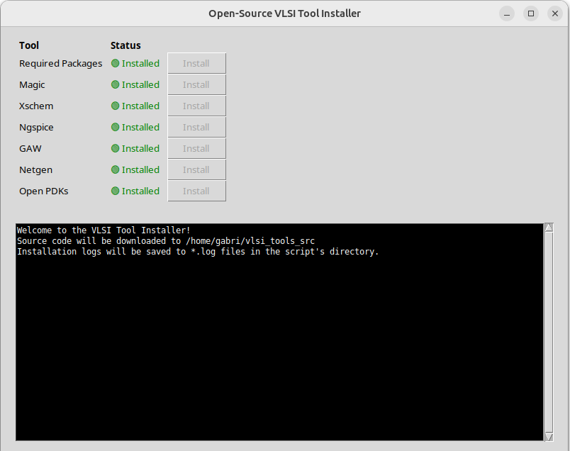

# Open-Source VLSI Toolchain Installer

A simple Graphical User Interface (GUI) to automate the installation of a complex open-source VLSI toolchain on Ubuntu. This tool simplifies the setup process by providing a one-click installation for each required component.



## Overview

This project provides a Python script that presents a list of required VLSI tools and automates their installation. It is designed for Ubuntu-based systems and handles the downloading of source code, compilation, and installation of tools like Magic, Xschem, Ngspice, and the Skywater 130nm PDK.

## Getting Started

These instructions will get you a copy of the project up and running on your local machine for development and testing purposes.

### Prerequisites

This script is designed to run on a clean **Ubuntu 24.04** installation.

Before running the installer, you need to have Python 3 and the `tkinter` library installed.

1.  **Update your package list:**
    ```bash
    sudo apt-get update
    ```

2.  **Install Python 3 and pip:**
    ```bash
    sudo apt-get install -y python3 python3-pip
    ```

3.  **Install tkinter:**
    ```bash
    sudo apt-get install -y python3-tk
    ```

### Installation

1.  **Clone the repository:**
    ```bash
    git clone <your-repo-url>
    cd <your-repo-directory>
    ```

2.  The script is ready to run. No further installation is required.

## Usage

To run the installer, execute the following command in your terminal:

```bash
python3 vlsi_installer_gui.py
```

The GUI will launch, showing a list of tools. Click the "Install" button next to each tool to begin the installation process. It is recommended to install the tools in the order they appear. The output of the installation process will be displayed in the text box at the bottom of the window.

## Troubleshooting

### `open_pdks` installation fails with `magic --version` error

A common issue is the failure of the `open_pdks` installation with an error related to `magic`, even if Magic appears to be installed correctly.

*   **Root Cause:** This is often caused by conflicting environment variables (e.g., `CAD_ROOT`, `MAGIC_BIN`) in your shell configuration files (like `~/.bashrc`).

*   **Solution:**
    1.  **Clean your environment:** Ensure that your `~/.bashrc` file does not contain any old or conflicting environment variables related to VLSI tools.
    2.  **Start a new terminal:** After cleaning up your configuration files, you **must** close the current terminal and open a new one.
    3.  **Use the installer:** Run the GUI and install `Magic` first. Once it completes successfully, proceed to install `Open PDKs`.
